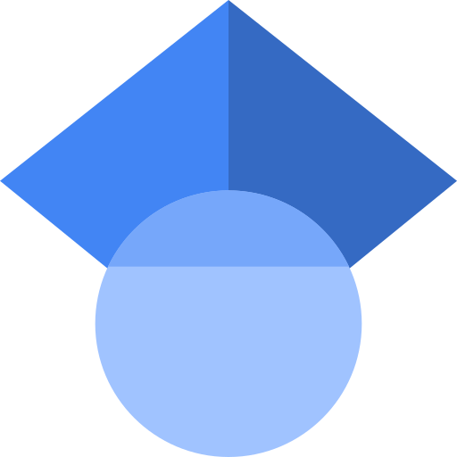

## about me 🤖

Hello, I am a 👨🏻‍🎓 **Ph.D. student** from **Hiroshima University**, studying 👨🏻‍🔬 **organic chemistry**. I was born in [**Qingdao, P.R.China**](https://en.wikipedia.org/wiki/Qingdao) 🇨🇳, and now living in 📍 [**Hiroshima, Japan**](https://en.wikipedia.org/wiki/Higashihiroshima) 🇯🇵. My current research focuses on the kinetic stabilization of localized singlet 1,3-diraricaloids.

 
 

## may u needs ✨

<a href="https://orcid.org/0000-0002-9996-586X">  <b>ORCiD</b> 0000-0002-9996-586X</a>

<a href="https://scholar.google.co.jp/citations?user=gzUh6CMAAAAJ&hl=ja">  <b>Google Scholar</b> Zhe Wang</a>

<a href="https://www.researchgate.net/profile/Zhe-Wang-84">  <b>ResearchGate</b> Zhe Wang</a>

<a href="https://researchmap.jp/wangzhe">  <b>researchmap</b> Zhe Wang</a>

<a href="https://github.com/wongzit">  <b>GitHub</b> wongzit</a>

<a href="https://www.instagram.com/tetsu_____/">  <b>Instagram</b> tetsu_____</a>

<a href="https://twitter.com/oooooootetsu">  <b>Twitter</b> @oooooootetsu</a>

✉️&ensp;&ensp;**Mail to** zit.wong1995[at]gmail.com

 
 

## useful links 🌏

<!--
[**Old Version**](https://www.wangzhe95.net/) of my personal homepage.
-->

[**HU-ROC**](https://hiu-roc.webnode.jp/): Homepage of Research group of Reaction Organic Chemistry, Hiroshima University.

[**WebPlotDigitizer**](https://automeris.io/WebPlotDigitizer/): Web based tool to extract data from plots, images, and maps.

[**Unit Conversion & Calculation**](https://ha2.seikyou.ne.jp/home/Takehito.Senga/geocity/unitconversion.html#Photon): Java script for unit conversion.

[**Pressure-Temperature Nomograph Interative Tool**](https://www.sigmaaldrich.com/JP/ja/support/calculators-and-apps/pressure-temperature-nomograph-interactive-tool): Boiling point *vs* pressure calculator.

[**CCCBDB**](https://cccbdb.nist.gov/vibscalejust.asp): Precomputed vibrational scaling factors.

[**CHESHIRE**](http://cheshirenmr.info): Computed NMR scaling factors.

[**Online Molecular Viewer**](https://liwt31.github.io/2022/01/02/online_viewer/) based on XYZ coordinates.

[**Maze Generator**](https://www.mazegenerator.net): A maze generator.

 
 

> Unless we change directions, we will end up where we are headed.   -- Confucius

